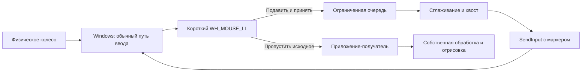

# Smoove 2.0 — план разработки для Windows 11

Дата: 9 октября 2026 года. Статус: начата веха 1; реализован и автоматически проверен исследовательский прототип общей модели и controlled Win32-пути. Визуальная совместимость сторонних приложений и допуск MVP ещё не подтверждены.

Текущая реализация: `src/Smoove.Core`, `src/Smoove.Probe`; запуск и проверки описаны в [README.md](README.md). Измерения, выявленные ограничения и оставшаяся приёмка: [docs/PROTOTYPE-RESULTS.md](docs/PROTOTYPE-RESULTS.md). WinForms служит только диагностическим приёмником первой вехи; финальный интерфейс настроек по этому плану остаётся WinUI 3.

Исходные предположения: Windows 11, обычная мышь с колесом, локальное приложение, один пользовательский сеанс, без облака и постоянных прав администратора. Первая целевая архитектура — x64; ARM64 проверяется отдельно перед заявлением поддержки.

Обозначения: **подтверждено API** — возможность или ограничение описаны Microsoft; **предложено** — проектное решение; **проверить** — гипотеза, которую должен подтвердить прототип. Документация API и официальные исходники документации сверены 9 октября 2026 года. Это не подтверждает поведение конкретных версий сторонних приложений.

## 1. Краткий вывод об осуществимости

**Гарантировать одинаковую плавную прокрутку во всех приложениях нельзя.** Можно преобразовывать часть событий колеса в последовательность меньших дельт и управлять их распределением во времени. Приложение-получатель само решает, как превращать дельты в строки, пиксели, масштабирование или другие действия.

Реалистичное обещание продукта: «Настраиваемое сглаживание и скорость колеса в проверенных приложениях и сценариях. Быстрое отключение и сохранение стандартного ввода там, где преобразование не подходит». Формулировки «как тачпад во всех программах» и «полная совместимость» недопустимы до доказательств; универсальность всё равно ограничена платформой.

### Главный критерий продукта: единое движение всей серии шагов

Уточнение пользователя: длинная страница должна мягко скользить, как при использовании качественного тачпада или прокрутки в macOS. Множество щелчков колеса объединяются в один непрерывный жест с плавным разгоном, изменением скорости и инерционным торможением. Отдельные строки и шаги не должны ощущаться во время обычного непрерывного вращения.

Каждый новый щелчок поддерживает или меняет уже происходящее движение. Он не запускает самостоятельную анимацию, не обнуляет скорость и не повторяет цикл «разгон — остановка». Сглаживание каждого щелчка по отдельности, даже при частой отправке событий, не удовлетворяет этому требованию, если сохраняется ощущение пульсации или ступеней.

Это обязательный результат для поддерживаемых сценариев, включая MVP. Пользователь должен выбирать между более тягучим, инерционным движением и более быстрым, отзывчивым; в обоих случаях серия шагов должна восприниматься как единая анимация. Сходство с macOS/тачпадом — ориентир ощущения, а не обещание точного воспроизведения их алгоритмов.

Одиночный щелчок также обрабатывается плавно, но не является достаточной проверкой продукта. При очень редких щелчках движение может успеть закончиться до следующего: предсказать будущий ввод невозможно. Интервалы, при которых шаги сливаются, и компромисс между мягкостью, временем хвоста и отзывчивостью нужно определить экспериментально для каждого пресета.

### Что именно позволяет Windows

| Уровень | Возможность | Граница обещания |
|---|---|---|
| Подтверждено API | `WM_MOUSEWHEEL` допускает дельты меньше `WHEEL_DELTA = 120` [1] | Это целые единицы колеса, а не дробные пиксели |
| Подтверждено API | `WH_MOUSE_LL` наблюдает события и позволяет подавить событие в своей цепочке обработки [2] | Не является универсальным фильтром всех путей ввода и всех сеансов |
| Подтверждено API | `SendInput` вставляет синтетический ввод [3, 4] | Не задаёт окно получателя; ограничен UIPI; результат не доказывает отрисовку |
| Предложено | Скорость, направление, временное сглаживание, ограниченный хвост движения | Их визуальный результат зависит от приложения |
| Проверить | Chromium, Qt, WinUI и другие обработчики используют малые дельты без округления и неприятного дополнительного сглаживания | Нужны тесты конкретных версий и областей интерфейса |
| Нельзя гарантировать | Пиксельное движение, одинаковые границы и инерция в чужом приложении | Приложение может накопить дельты до 120, округлить их, игнорировать или интерпретировать как команды |

Важный пример: `120` и двенадцать событий по `10` имеют одинаковую сумму. Один обработчик прокрутит частями, другой выполнит один шаг после накопления, третий проигнорирует маленькие события. Повышение частоты отправки не исправляет последние два случая.

Высокоточное колесо может уже выдавать маленькие дельты. Precision Touchpad — другой источник ввода с собственными жестами и механизмами обработки; отправка частых событий колеса не превращает мышь в Precision Touchpad. Глобальное получение ввода не равно глобальному управлению анимацией.

## 2. Пользовательский сценарий и требования

1. Пользователь устанавливает приложение в свой профиль; установщик доставляет нужный runtime либо самодостаточную сборку. Ручной запуск сервера и установка SDK не нужны. Повышение прав для работы не запрашивается.
2. При первом запуске открываются настройки: объяснение границ совместимости, выключенный по умолчанию автозапуск, кнопка включения и область проверки. Начальный режим обрабатывает только проверенные приложения; остальные получают исходное колесо.
3. Пользователь выбирает подтверждённый пресет, меняет скорость и плавность, проверяет результат в предпросмотре и нужной программе. Изменения применяются без перезапуска, сохраняются между сеансами.
4. Закрытие окна оставляет приложение в трее. Первый раз это поведение объясняется. При последующем входе в Windows, если автозапуск разрешён, окно не появляется.
5. Из трея пользователь открывает настройки, ставит сглаживание на паузу или отключает его для выбранного приложения. Название программы показывается до применения правила.
6. «Выход» отменяет запланированный хвост, снимает hook, убирает значок и завершает процесс. Следующие физические события идут обычным путём. Уже вставленные в системную очередь события отозвать нельзя.
7. Повторный запуск открывает существующий экземпляр, а не создаёт второй перехватчик. Если Windows или пользователь отключили автозапуск, приложение показывает фактическое состояние и не включает его обходным способом.

Кнопка паузы должна быть доступна из трея и настроек. Глобальная комбинация через `RegisterHotKey` — полезное дополнение после проверки конфликтов, не повод ставить глобальный keyboard hook.

## 3. Функциональные требования

Настройки ниже описывают целевую модель. В MVP попадают только параметры, которые прошли проверку механизма и совместимости.

| Параметр | Эффект для пользователя | Условие реализации |
|---|---|---|
| Включить / пауза | Преобразование или исходное колесо | Пауза сразу отменяет будущую отправку |
| Скорость / множитель | Больше или меньше движения на тот же поворот | Умножает единицы колеса; расстояние в пикселях зависит от приложения |
| Плавность | Подавляет ощущение отдельных щелчков и пульсацию скорости во всей серии | Управляет общей моделью движения; длинное сглаживание влияет на отзывчивость |
| Инерция / торможение | Страница продолжает скользить после прекращения вращения и мягко останавливается | Управляет затуханием общей скорости и длительностью ограниченного хвоста; завершённый жест MVP сохраняет суммарную дельту |
| Разгон / отзывчивость | Определяет, насколько быстро общее движение набирает скорость при начале и изменении вращения | Начало движения должно быть своевременным, а набор скорости — плавным; параметр не перезапускается на каждом щелчке |
| Ускорение при быстром вращении | Быстрые обороты проходят большее расстояние | Это намеренное изменение расстояния, отдельное от разгона анимации; выключено до проверки |
| Остановка / смена направления | Быстро и управляемо прекращает старое движение и начинает обратное | Обычный разворот использует короткое плавное торможение; пауза, ошибка и смена контекста немедленно отменяют будущий хвост |
| Инверсия вертикали | Обратное направление обычной прокрутки | Не применять к пропущенным сочетаниям масштабирования и другим командам |
| Горизонтальная прокрутка | Сглаживание горизонтального колеса | Отдельная ось; доступность перехвата `WM_MOUSEHWHEEL` и доставка проверяются на устройстве |
| Инверсия горизонтали | Отдельное направление по X | После проверки горизонтального пути; положительная дельта Windows означает вправо [4] |
| Shift + колесо | Возможная горизонтальная прокрутка | По умолчанию исходное сочетание; приложения трактуют его по-разному |
| Правила приложений | Разрешить, исключить, использовать общий профиль | Основа MVP — список проверенных программ и пользовательские исключения; расширенные профили позднее |
| Пресеты | «Отзывчивый» и «Тягучий», позднее дополнительные | Наборы проверенных значений одной модели; в обоих обязательна слитность серии |
| Сброс | Возвращает параметры приложения к исходным | «Отключить обработку» и «Сбросить настройки» — отдельные действия |

Модель MVP должна иметь проверяемые параметры разгона, сглаживания серии и торможения. Они могут быть связаны математически, но должны позволять получить оба запрошенных характера: «тягучий и инерционный» и «быстрый и отзывчивый», сохраняя слитность движения. В UI сначала предложить пресеты и основные регуляторы, а отдельные параметры разгона и торможения — в дополнительных настройках после проверки их эффекта. Два одинаковых ползунка с разными названиями недопустимы.

Инерционное ощущение не обязательно требует дополнительного расстояния сверх поворота колеса: можно плавно продолжать общий жест до накопленной цели. Сохранение суммы дельт не заменяет требования к форме движения. Если такая модель не даёт нужного ощущения скольжения, её нужно пересмотреть по результатам прототипа; один только учёт остатка не считается достаточным результатом. Свободное дополнительное расстояние инерции остаётся отдельной отложенной возможностью.

`Ctrl`, `Alt`, `Shift` и нажатые кнопки мыши по умолчанию переводят событие в исходный путь и отменяют хвост. Это защищает масштабирование, панорамирование и специальные команды. Поддержанные сочетания разрешаются отдельным правилом после проверки.

Настройки Windows «строк за щелчок», «страница за щелчок», горизонтальных символов и прокрутки неактивных окон учитываются как исходные условия [7]. Не менять их автоматически для достижения плавности. Значения 0 и `WHEEL_PAGESCROLL` проверяются отдельно; при неясной семантике — исходный путь.

## 4. Нефункциональные требования

Следующие числа — **предлагаемые бюджеты измерений, не гарантии**. После прототипа их нужно принять или пересмотреть на записанной конфигурации Windows, CPU, мыши, частоты дисплея и питания.

| Свойство | Предлагаемая цель | Способ проверки |
|---|---|---|
| Callback hook | p99 менее 1 мс без I/O, ожиданий и тяжёлых выделений | Метки монотонного времени; WPR/WPA; обычный ввод и движение мыши 1000 Гц |
| Первая отправка | p95 не более 10 мс от входа в hook до первого `SendInput` | Метки в ядре; это не полная задержка от физического устройства до экрана |
| Визуальная отзывчивость | Дополнительная задержка первого видимого движения относительно исходного ввода — ориентир не более одного кадра | Контролируемое окно с измеряемым смещением; высокочастотная съёмка для сторонних программ |
| Слитность серии | Нет повторных остановок, скачков скорости и построчных ступеней, привязанных к щелчкам, в допущенном диапазоне вращения | Графики смещения и скорости с отметками входных импульсов; видео длинной страницы и оценка пользователя для обоих характеров движения |
| CPU в простое | Ориентир до 0,1% общей мощности CPU на эталонном ПК | Три повторения по 5 минут; отдельно полный простой и движение курсора без колеса |
| CPU при скролле | Ориентир до 1% общей мощности CPU на эталонном ПК | Повторяемый сценарий 10 минут; измерять утилиту отдельно от принимающего приложения |
| Память | Начальный ориентир до 100 MiB private bytes с закрытыми настройками | До первого открытия UI, после закрытия UI и после длительного сеанса; рабочий набор учитывать отдельно |
| Энергия | Нет постоянного таймера сглаживания в простое; разница потребления в пределах воспроизводимого шума измерений | WPR/WPA: пробуждения, таймеры, CPU; одинаковый сценарий на батарее с фиксированной яркостью |
| Учёт дельт | При завершённом жесте, множителе 1 и без отмены сумма отправленного равна сумме принятого | Автоматические последовательности положительных/отрицательных и малых дельт; отмены учитываются отдельно |
| Надёжность | Нет циклов, дублей, неограниченной очереди и постоянной отправки после остановки | Нагрузочные тесты, переполнение, зависание UI, отказ `SendInput`, сон, блокировка, смена пользователя |

Для распределений собирать достаточно событий для p95/p99 и сохранять сырые замеры. Не скрывать редкие длинные задержки средним значением. Время завершения хвоста измерять отдельно от задержки первого движения. При разделении host/UI показатели ресурсоёмкости относятся к сумме всех процессов Smoove, а не только к маленькому host.

Дополнительные требования:

- Локальная обработка. Сетевые запросы, учётная запись и телеметрия не нужны.
- По умолчанию не писать координаты, названия окон, содержимое документов и полный поток ввода. Диагностический журнал ограничен по размеру; подробная запись включается пользователем и остаётся локальной.
- Настройки сохранять в `%LOCALAPPDATA%\Smoove\settings.json`, с версией схемы, проверкой диапазонов и атомарной заменой через временный файл. Повреждение файла не должно ломать ввод; безопасный старт — обработка выключена до восстановления.
- При блокировке, отключении сеанса, сне и смене пользователя отменять хвост и останавливать обработку своего сеанса; после возврата проверять состояние и начинать без старого движения.
- Не обрабатывать защищённый рабочий стол UAC, экран входа и чужой сеанс. Не использовать Windows Service как обход этих границ.
- При завершении процесса будущий физический ввод возвращается к стандартному пути. Уже подавленные, но не доставленные события при аварии могут быть потеряны: стопроцентное восстановление невозможно обещать.
- Доступность: клавиатурная навигация, Narrator, видимый фокус, масштабирование текста, контрастные темы и режим уменьшенного движения. Предложить короткий хвост или отключение эффекта без навязывания анимации.

## 5. Техническая архитектура

### 5.1. Сравнение механизмов Windows

| Вариант | Совместимость и задержка | Права и безопасность | Поддержка / решение |
|---|---|---|---|
| Системные настройки `SystemParametersInfo` | Часть программ соблюдает число строк/символов; приложения могут иметь свою логику. Новая инерция не появляется | Обычно пользовательский уровень; изменения глобальны для пользователя | Читать исходные условия. Системные флаги анимации отдельных контролов не делают плавными все приложения |
| Raw Input, `WM_INPUT` | Асинхронное наблюдение, идентификаторы устройств, диагностика высокоточного ввода | Обычный пользовательский процесс | Полезно для исследования; не может сам заменить колесо в чужих процессах. `RIDEV_NOLEGACY` относится к зарегистрированному приложению [5, 6] |
| `WH_MOUSE_LL` + `SendInput` | Наиболее подходящий общий прототип для обычного wheel-пути. Дополнительный переход в утилиту и задержка сглаживания | Без постоянного admin для обычных доступных окон; UIPI и ограничения рабочего стола сохраняются | Рекомендованный старт. Нужны правила, исключения, короткий callback и тесты каждого обработчика |
| `PostMessage` / `SendMessage` с `WM_MOUSEWHEEL` | Можно адресовать HWND, но это сообщение окну, а не эквивалент физического ввода. Может не попасть во внутреннюю область или быть проигнорировано; синхронный вызов может блокироваться | UIPI и политика принимающего процесса; нельзя навязывать фокус | Не использовать как универсальную запасную отправку. Только отдельный адаптер с доказанной необходимостью |
| UI Automation `ScrollPattern` | Поддержанные провайдеры дают дискретные операции или проценты; обычно нет общего пиксельного таймлайна [13] | Ограничения доступа к процессам; автоматизация может быть медленной | Не основа быстрого глобального скролла. Возможен специализированный адаптер |
| Расширение/плагин/API приложения | Может управлять собственным смещением и анимацией; лучший контроль внутри конкретной программы | Разрешения и модель безопасности приложения | Позднее, если пользователь согласен с отдельной интеграцией; поддержка каждой программы отдельно |
| Hook с внедряемой DLL / патчинг процесса | Доступ к локальному обработчику не даёт универсального протокола; разрядность и версии усложняют всё | Существенные конфликты с защитой, целостностью и политиками | Не выбирать для MVP; `WH_MOUSE_LL` не требует DLL в каждом целевом процессе [2] |
| HID/filter/virtual-device driver | Может изменить путь аппаратного ввода и некоторые сценарии устройств; приложение всё равно определяет отрисовку | Установка с повышенными правами, подпись, требования WDK/HVCI, риск системных сбоев и конфликтов | Только отдельное исследование после доказанной необходимости. Не решает универсальную пиксельную плавность |

Доступный пользовательский прототип достаточен, чтобы проверить основной продуктовый вопрос. Драйвер становится темой лишь при доказанном требовании к источнику устройства или аппаратному пути, которое нельзя решить допустимым пользовательским способом. Из-за нелинейной/дискретной отрисовки драйвер не нужен: причина находится внутри приложения.

### 5.2. Выбор стека

| Стек | Что подходит | Компромисс |
|---|---|---|
| C#/.NET + WinUI 3 + Windows App SDK | Настоящие Fluent-контролы, темы, доступность; Win32 interop для ввода и трея | Runtime и UI имеют цену по памяти; GC влияет на процесс. Трей реализуется Win32 API, не специальным встроенным контролом WinUI |
| C++/Win32 для фоновой части; C++/WinRT + WinUI при необходимости UI | Контроль выделений и меньшая потенциальная цена фонового процесса | Более сложная и рискованная реализация владения ресурсами; выигрыш надо измерить, визуальная совместимость не расширяется |
| C# WinForms/WPF | Зрелые desktop-механизмы, быстрый старт; у WinForms готовый `NotifyIcon` | Стандартные контролы не эквивалентны WinUI 3; копирование внешнего вида не обеспечивает дизайн-систему Windows 11 |
| Avalonia | Полезна при реальном требовании нескольких ОС | Здесь такого требования нет; дополнительный UI-слой и отдельная проверка интеграции Windows |
| Electron/WebView как оболочка | Быстрое web-UI | Не нужен для небольших нативных настроек; увеличивает состав runtime. Входной механизм всё равно Win32 |

**Предложено:** первый продуктовый кандидат — C# на поддерживаемой LTS-версии .NET и стабильном Windows App SDK, с WinUI 3. Версии зафиксировать после проверки требований SDK и публикации. Для исследования ввода достаточно минимального пользовательского процесса без полноценного окна настроек.

Стартовая продуктовая архитектура — один процесс, без сервиса, драйвера, облака и лишних библиотек. UI создаётся по требованию. Закрытие окна не гарантирует выгрузку WinUI/.NET и возврат всей памяти: это измеряется. Если бюджет не проходит, сначала разделить компактный C# tray-host и запускаемый по запросу WinUI-процесс; C++ для ядра рассматривать только после измеренного ограничения. IPC между процессами заранее не добавлять.

### 5.3. Компоненты и прохождение события

Повторно пришедшее собственное событие пропускается через hook без преобразования. Схема описывает обычный wheel-путь, а не все варианты Raw Input, жестов и защищённого ввода.

Компоненты одного процесса:

- Dedicated hook thread с message loop. Hook живёт независимо от UI.
- Рабочий поток с ограниченной очередью, моделью движения и активным только во время движения планировщиком.
- Win32 скрытое top-level окно для трея, системных сообщений и уведомлений сеанса. Одного message-only окна недостаточно для широковещательного `TaskbarCreated`.
- `Shell_NotifyIcon`, стабильный идентификатор значка, callbacks и штатное контекстное меню; повторное добавление значка после перезапуска Explorer [8, 9].
- WinUI 3 UI thread и окно настроек, открываемое по запросу.
- Хранилище настроек и ограниченные диагностические счётчики. Фоновый путь читает готовый снимок настроек, а не обращается к UI.

**Приём события:**

1. При отрицательном `nCode` немедленно вызвать `CallNextHookEx`. При собственном маркере, чужом injected-вводе, паузе или неподдержанном событии — исходный путь.
2. Для обычного колеса определить ось и знаковую дельту. Малые дельты не превращать искусственно в ±120; учесть масштаб и дробный остаток. Вертикаль и горизонталь имеют отдельное состояние.
3. Проверить готовое правило приложения, кнопки/модификаторы и пригодность контекста. PID, путь, целостность процесса и сложные проверки кэшировать вне callback. Не получать UIA-дерево и не писать файл в hook.
4. Если процесс под курсором/возможный получатель неизвестен, имеет повышенную целостность, контекст изменился, рабочий поток нездоров или очередь заполнена — исходный путь и отмена устаревшего хвоста. Разрешённый foreground-процесс не доказывает, что разрешено окно под курсором.
5. Подавлять событие только после успешного принятия в очередь. Это снижает риск потери, но не устраняет сбой между подавлением и последующей отправкой.

**Модель движения:**

- На каждой оси хранить одно общее состояние жеста: целевое накопленное смещение, текущее вычисленное смещение, скорость и уже выданную часть. Если выбранная модель использует ускорение, сохранять и его состояние. Не создавать отдельные объекты анимации и таймеры для каждого щелчка.
- Каждый щелчок увеличивает общую цель. Положение и скорость в этот момент остаются непрерывными; движок пересчитывает дальнейшее движение из текущего состояния, без сброса скорости и повторного старта кривой. Одного сохранения положения недостаточно: скачки скорости также создают ощущение шагов.
- Первый импульс начинает движение с небольшого своевременного смещения и плавного набора скорости. Последующие импульсы поддерживают общий поток; при ускорении или замедлении вращения скорость меняется постепенно. Не ждать накопления всей серии: её конец заранее неизвестен.
- Между импульсами модель продолжает движение. После прекращения ввода общая скорость плавно затухает до остановки, без резкого обрезания хвоста и без отдельного торможения после каждого щелчка. Длительность затухания ограничена и настраивается.
- Для первого прототипа исследовать минимальную модель слежения за накопленной целью с непрерывной скоростью и регулируемыми разгоном и торможением. Выбор конкретного фильтра/уравнения — гипотеза до проверки: критически затухающий отклик без колебаний может быть кандидатом, но обязан пройти проверку пульсации на серии импульсов. Само название алгоритма не доказывает нужное ощущение.
- При множителе 1 завершённый, не отменённый жест сохраняет суммарную дельту. Инерция в этой модели распределяет оставшееся расстояние во времени; её качество оценивается по общему движению, а не только наличию остатка. Не допускать самопроизвольного обратного движения и лишнего перелёта через цель.
- Выдавать разницу между текущим вычисленным накопленным смещением и уже выданным. Округлять накопленное значение, сохраняя остаток, а не округлять независимо каждый маленький шаг.
- Использовать фактическое прошедшее монотонное время. Начальные частоты отправки для сравнения — около 60 и 120 событий/с во время движения; это гипотезы, не гарантированная синхронизация с кадрами чужого приложения.
- После задержки потока не отправлять бурст всех пропущенных тиков. Ограничить дельту и хвост; устаревшее движение отменить. Ограничения очереди, времени, величины импульса и диапазонов настроек определить измерениями.
- При обратном вращении немедленно учесть новый ввод, убрать устаревшую цель и выполнить короткое плавное торможение с переходом в обратное направление. Не продолжать длинный хвост в прежнюю сторону; не сбрасывать вычисленную скорость скачком ради разворота. Отдельно измерять задержку разворота и оставшееся движение в прежнюю сторону. Намеренную отмену учитывать отдельно от технической потери ввода.
- Пауза, выход, смена контекста и ошибки имеют приоритет над красивым торможением: будущая отправка прекращается сразу. Для нормального окончания жеста таких аварийных обрывов быть не должно. Финальный остаток и ограничение длительности не должны создавать заметный последний скачок; если выбранная модель этого не обеспечивает, пересмотреть модель.

**Отправка и защита:**

- `SendInput` с `MOUSEEVENTF_WHEEL` или отдельно проверенным `MOUSEEVENTF_HWHEEL`; не двигать курсор для выбора получателя.
- Каждое событие получает собственный pointer-sized маркер `dwExtraInfo`; callback проверяет маркер и `LLMHF_INJECTED`. Собственные события пропускаются; чужой injected-ввод по умолчанию также не преобразуется, чтобы не складывать эффекты разных утилит [3, 4, 10]. Маркер предотвращает цикл, но не является механизмом безопасности.
- Перед каждым небольшим пакетом проверить актуальность контекста, состояние модификаторов и возможность продолжения. При смене foreground-окна, переходе курсора к другой области, нажатии кнопки или модификатора, блокировке и паузе — отменить остаток. При неизвестной внутренней области выбирать консервативную остановку при перемещении курсора.
- `SendInput` не принимает HWND. `WindowFromPoint` и foreground-окно дают лишь сведения о возможном получателе; web-элементы внутри одного HWND неразличимы таким способом. Между проверкой и доставкой остаётся гонка. Она ограничивает обещание точной маршрутизации.
- Проверить количество вставленных событий. Ошибка или частичный результат прекращают обработку и возвращают будущий физический ввод в исходный путь. Не повторять вслепую весь пакет: это создаёт дубли. API не гарантирует точную диагностику UIPI [3].
- Вызов `SendInput` с успешным результатом подтверждает вставку в поток, а не принятие приложением, перемещение содержимого и отсутствие второго канала ввода.
- Не полагаться на `MOUSEEVENTF_MOVE_NOCOALESCE` для колеса: документированный флаг относится к `WM_MOUSEMOVE` [4].

**Особые границы:**

- Low-level hook должен быстро возвращать управление. Microsoft документирует его незаметное удаление при тайм-ауте; на Windows 11 максимально допускаемый системой тайм-аут — 1000 мс, но это аварийная граница, а не допустимая задержка ввода. Прямого надёжного запроса «hook всё ещё активен?» нет [2]. Состояние UI не должно изображать аппаратно подтверждённую исправность; heartbeat потока не доказывает наличие hook.
- `MSLLHOOKSTRUCT` не даёт идентификатора мыши. Raw Input различает устройства, но сопоставление двух асинхронных потоков по времени не гарантирует точность. Для MVP — общий профиль мышей; отдельные профили устройств отложены.
- Некоторые тачпады и виртуальные источники могут выглядеть как обычный wheel-ввод. Гарантированное исключение всех тачпадов по данным одного `WH_MOUSE_LL` не обещать. На системах с мышью и тачпадом это отдельный допуск совместимости.
- Программы с Raw Input, DirectInput, собственными HID-путями и игры требуют самостоятельной проверки: подавление legacy-события не доказывает подавление аппаратного ввода во всех каналах. Возможны исходное действие плюс синтетическое.
- Внизу/вверху списка utility обычно не знает, что достигнута граница. Нельзя достоверно управлять bounce, передачей скролла внешнему контейнеру и внутренним overscroll без API приложения.

**Отличие от настоящей плавности:** временное дробление колеса — синтетический поток. Если приложение превращает малые дельты в частичные смещения и нормально композитит кадры, результат может быть визуально непрерывным. Если оно округляет до строки/команды, остаётся последовательность шагов. Прямое управление пиксельным scroll offset и анимацией возможно в своём UI или через поддержку целевого приложения; собственный красивый предпросмотр не доказывает чужую совместимость.

## 6. UX и дизайн

Использовать реальные WinUI 3 controls, системные ресурсы Fluent, штатное поведение фокуса, клавиатуры и accessibility. Скругления и полупрозрачный фон сами по себе не делают интерфейс нативным.

Окно настроек: `NavigationView`, обычный `AppWindow` и системная рамка/заголовок; в узком окне навигация сворачивается. Светлая, тёмная и контрастная темы, масштабирование текста и DPI нескольких мониторов обязательны. Mica уместна для фона с корректным системным fallback, но не является критерием работоспособности.

| Раздел | Содержание и штатные элементы |
|---|---|
| Прокрутка | `ToggleSwitch` включения, `ComboBox` пресета, подписанные `Slider` скорости и плавности, числовой ввод `NumberBox` там, где важна точность; дополнительные параметры раскрываются постепенно |
| Приложения | Список правил, выбор исполняемого файла, включение и исключение; подтверждённые ограничения и дата проверки версии |
| Общие | Автозапуск с фактическим системным состоянием, тема, поведение при закрытии, пауза/горячая клавиша |
| Диагностика | Версия, выбранный режим, причины пропуска, отказы отправки, очередь и отмены; кнопка локального экспорта и сброса настроек |

Предпросмотр состоит из длинного списка/текста, горизонтальной области и вложенного контейнера. По умолчанию проверять обычное колесо через тот же внешний путь преобразования, а не подменять результат собственной pixel-анимацией. Если есть демонстрация собственной анимации, явно обозначить её как демонстрацию кривой. Настройки вне области предпросмотра не должны случайно менять значения от остаточного скролла.

Основной сценарий предпросмотра — продолжительное вращение по длинной странице: пользователь видит единый разгон, непрерывное скольжение и мягкую остановку. Предложить сравнить пресеты «Тягучий» и «Отзывчивый» на одной серии действий. Плавная демонстрация одиночного щелчка не заменяет эту проверку.

Состояния: «Включено для проверенных приложений», «Пауза», «Для этого приложения исходная прокрутка», «Ограничение прав», «Обработка отключена после ошибки». Причину показывать текстом, не только цветом; `InfoBar` использовать для значимой ошибки, без постоянных всплывающих уведомлений.

Трей:

- Основное действие — открыть настройки. Контекстное меню доступно мышью и клавиатурой.
- «Включено» / «Пауза» с видимым состоянием.
- «Отключить для [название программы]»: зафиксировать исходную программу до открытия меню, чтобы правило не попало на Explorer или окно настроек; при неоднозначности показать выбор в настройках.
- «Настройки…», «Выход».
- Tooltip показывает состояние и название продукта. Значок восстанавливается после перезапуска Explorer; доступность меню проверяется отдельно. Не считать размещение значка вне области переполнения управляемым обещанием приложения.

## 7. Этапы разработки

Вехи идут по зависимостям; переход к красивому UI не должен опережать доказательство полезности механизма.

| Веха | Результат | Критерии завершения | Зависимость |
|---|---|---|---|
| 1. Исследование и минимальный прототип | Наблюдение дельт, controlled receiver, тест синтетических малых событий, общая модель серии, затем ограниченный hook + sender | Знаки/оси/суммы корректны; собственный ввод не зацикливается; серия даёт единую траекторию без перезапуска скорости; выявлены границы прав и задержки | Подтверждение API и описание сценариев |
| 2. Первая матрица совместимости | Отчёт для браузера, Win32, WinUI/UWP, Electron, Telegram и графических областей | Каждый сценарий имеет версию, настройки, статус и воспроизводимое свидетельство; известно, где есть улучшение, дискретность, игнорирование или вред | Веха 1 |
| 3. Фоновый MVP | Один экземпляр, очередь, сглаживание, пауза, правила, отмена хвоста, сохранение настроек, базовый трей | Нет циклов и неограниченного роста; безопасное выключение и отказы проверены; обрабатываются только допущенные сценарии | Положительное решение по вехе 2 |
| 4. Настройки и нативный интерфейс | WinUI-окно, валидные настройки и пресеты, честный preview, доступность | Изменения видны и сохраняются; UI не блокирует hook; работают keyboard/Narrator/темы/DPI; нет ложных обещаний состояния | Веха 3 |
| 5. Полная проверка | Регрессия ввода, стресс, длительная работа, энергия, безопасность и сеансы | Согласованные бюджеты проходят; сбои не оставляют продолжающийся sender; неподдержанные сценарии исключены; остаточные ограничения записаны | Вехи 3–4 |
| 6. Упаковка и выпуск | Подписанный пакет/установщик, пользовательский автозапуск, release notes и таблица поддержки | Чистая Windows 11 без SDK: установка, первый запуск, вход, обновление и удаление проходят; настройки сохраняются при обновлении; автозапуск удаляется корректно | Веха 5 |

Для исследования использовать unpackaged запуск. Для первого установочного релиза оценить **подписанный MSIX с packaged desktop/full-trust приложением**, доставкой зависимостей и `StartupTask` [11]. Принять эту упаковку после проверки отсутствия UI при автозапуске, трея, hook и обновления на чистой машине. Full trust в таком пакете не означает admin и не снимает UIPI.

Если требования канала распространения не подходят MSIX, выбрать один per-user установщик unpackaged-приложения. Тогда явно обеспечить Windows App SDK runtime/bootstrap либо поддержанный self-contained вариант [12], и пользовательский механизм автозапуска. Не реализовывать две схемы доставки заранее. Не распространять пакет, требующий от обычного пользователя установки Visual Studio, SDK или Developer Mode.

Для packaged-варианта учитывать `StartupTaskState.DisabledByUser` и `DisabledByPolicy`: приложение не может произвольно отменить решение пользователя или политики [11]. По умолчанию запись автозапуска выключена; включение — только по выбору пользователя.

Сроки оценивать после вех 1–2: до них неизвестно, сколько поддерживаемых приложений и специальных режимов окажется нужно. Готовность определяется результатами, а не количеством экранов.

## 8. План проверки совместимости

### 8.1. Матрица

Все перечисленные строки изначально имеют статус **«не проверено»**. Класс UI не означает совместимость всей программы.

| Группа | Минимальные представители | Области и обязательные сценарии |
|---|---|---|
| Браузеры Chromium | Edge, Chrome | Длинная страница, PDF, nested overflow, iframe, текстовое поле, масштабирование Ctrl+wheel; собственное сглаживание включено/выключено, где настройка доступна |
| Браузер с другим движком | Firefox | Те же сценарии и настройка родной плавности; взаимодействие двух сглаживаний |
| Win32 | Проводник, контролируемые стандартные ListBox/Edit/ListView, legacy-программа | Списки и разные виды просмотра, текст, целые строки, число строк 0/1/3 и страница, границы контейнера |
| WinUI 3 / UWP | Controlled WinUI `ScrollViewer` и установленный UWP-образец с известным стеком | Малые дельты, вложенные области, инерция, горизонталь; packaged-приложение не обязательно UWP |
| Electron | VS Code, Discord; desktop Figma — отдельно с записью версии | Редактор, список, терминал, панели, области с собственной обработкой; частота и масштаб UI |
| Telegram Desktop | Реальная установленная версия; обычно Qt, не считать её Electron | История чата, список чатов, настройки, поле ввода, открытые медиа |
| Photoshop | Зафиксированная версия и настройки ввода | Холст отдельно от слоёв/истории/списков/диалогов; zoom, pan, модификаторы и плагины |
| Figma | Browser и Desktop как отдельные цели | Холст, layers/assets, диалоги, текстовые поля; wheel-pan/zoom и сочетания клавиш; поддержка панели не доказывает поддержку холста |
| Игры / Raw Input | Собственный raw-input receiver и безопасный тестовый пример | Двойной канал и точность; реальные игры с античитом исключены из первой версии, не проверять защиту обходами |
| Повышенные права | Обычный и повышенный receiver; повышенный редактор | Исходный ввод проходит; utility не подавляет колесо, которое не может доставить; UI сообщает ограничение |

Дополнительные измерения по каждой существенной группе:

- Одно движение ±120; повторные ±120; малые ±1/±10/±30; быстрый поток; остановка и резкая смена направления.
- Продолжительная равномерная серия, серия с неравномерными интервалами, постепенный разгон/замедление вращения, короткие паузы и новый ввод во время торможения. Тестовые интервалы между щелчками: 20, 50, 100, 200 и 400 мс; это исследовательская сетка, а не обещание слитности во всём диапазоне. Для каждого пресета определить подтверждённый диапазон и проверить реальное ручное вращение.
- Реальная мышь с детентами, высокоточное/free-spin колесо, polling 125/1000 Гц; устройства производителя с включёнными и выключенными утилитами. Polling мыши не равен частоте wheel-событий.
- Горизонтальное колесо/наклон, Shift+wheel, Ctrl/Alt, нажатые кнопки, диагональный ввод. Вертикальный и горизонтальный знаки проверяются независимо.
- Две мыши по очереди и одновременно; подключение/отключение USB и Bluetooth; мышь вместе с тачпадом. Общий профиль — единственное исходное обещание.
- Один и несколько мониторов; разные DPI, 60/120/144/240 Гц, мониторы слева/выше основного и отрицательные координаты [1].
- Окно активно/неактивно; системная прокрутка под курсором включена/выключена; курсор между вложенными областями; переключение окна и модификаторов во время хвоста.
- Верх/низ списка, достижение края вложенной области, переход скролла родителю, меню и tooltip, модальные окна, dropdown/number input, выделение/редактирование текста.
- Сон/возврат, блокировка, Fast User Switching, удалённый сеанс как отдельный необязательный режим; перезапуск Explorer, зависание и принудительное завершение utility.

### 8.2. Метод и критерии

Сравнивать три режима: исходный ввод, нативные настройки плавности целевой программы и Smoove. Не доказывать пользу отключением полезных функций конкурирующего пути без отдельного сравнения.

Для controlled receiver протоколировать исходную и выходную сумму дельт, время первого/последнего события и фактическое смещение. Для сторонней программы фиксировать видео и сценарий; при возможности измерять движение контрольного элемента по кадрам. ETW/DWM present сам по себе не доказывает, что прокрутилась нужная область.

### 8.3. Приёмка единого жеста

Проверять выходную траекторию движка и отдельно фактическое движение страницы. У движка позиция и скорость не должны сбрасываться при новом щелчке; на странице не должно быть заметных повторных остановок или построчных скачков в заявленном диапазоне. Небольшие целочисленные выходные дельты сами по себе не означают видимую дискретность, но и не доказывают её отсутствие.

Для длинной серии построить смещение и скорость по времени, отметить моменты входных щелчков. Измерять пульсацию скорости, остановки между импульсами, время реакции на изменение темпа, длительность торможения и финальный скачок. Численные пределы этих показателей установить после сравнения прототипов с реальным тачпадом и исходным колесом на одинаковом сценарии. Начало и конец жеста анализировать отдельно от установившегося движения.

Обязательные признаки успешного результата:

1. При привычном непрерывном вращении шаги сливаются в одну анимацию, без цикла «разгон — остановка» на каждом щелчке.
2. Новый импульс во время движения или торможения продолжает существующее движение без рывка.
3. После прекращения вращения страница мягко замедляется и останавливается за ограниченное время.
4. В обоих пресетах — тягучем и отзывчивом — движение остаётся слитным; разница проявляется в реакции и торможении.
5. Эффект подтверждён в целевом браузере на длинной странице и оценён пользователем. Дополнительно проверены панели других программ; собственный preview не является достаточным свидетельством.

Если малые дельты принимаются, но серия по-прежнему ощущается как набор сглаженных шагов, главный критерий не выполнен. Для такого сценария нельзя ставить статус A или объявлять готовность MVP.

| Статус | Значение | Решение продукта |
|---|---|---|
| A | Серия шагов даёт единое наблюдаемое движение с плавным разгоном и остановкой; задержка и точность приемлемы | Допустить конкретную версию и сценарий после приёмки единого жеста |
| B | Дельты копятся/округляются; движение остаётся дискретным | Не обещать плавность; исходный путь либо отдельно проверенный режим скорости |
| C | События игнорируются, дублируются или выполняют нежелательную команду | Исключить сценарий/приложение |
| D | Контекст запрещён или надёжность доставки неизвестна | Исходный ввод без сглаживания |

Карточка результата: версия Windows и приложения, стек если известен, мышь/утилиты/режим колеса, системные настройки, права, дисплеи/DPI, профиль Smoove, сценарий, свидетельство, измерения и статус. При изменении существенной версии перепроверять; статус не переносится автоматически на всю семью Chromium/Electron/Qt.

## 9. Риски и способы снижения

| Риск | Снижение | Что остаётся |
|---|---|---|
| Приложение округляет/игнорирует дельты | Матрица, допуск только проверенного пути, исключения | Без поддержки получателя пиксельную плавность не создать |
| Двойное сглаживание / задержка | Сравнить с родным режимом, уменьшить хвост или оставить исходное колесо | Utility не управляет внутренним фильтром приложения |
| Сохраняется пульсация каждого щелчка | Общая модель с непрерывной скоростью; проверка длинных и неравномерных серий; настройка разгона и торможения | Более сильное сглаживание увеличивает задержку; модель и получатель должны совместно пройти приёмку |
| Цикл собственных событий | Маркер, injected-флаги, тест повторного прохождения, один экземпляр | Другие utility могут перехватывать и менять события по своим правилам |
| Дубли через альтернативный канал | Controlled raw-input test, отдельные тесты программ, исключить игры | Hook не является доказанной универсальной заменой аппаратного ввода |
| Потеря точности из-за округления | Учёт накопленного значения и остатка; контроль сумм; знаков и диапазонов | Получатель может повторно округлить/масштабировать |
| Хвост ушёл в другой контрол / zoom | Отмена при смене контекста и модификаторов, консервативная отмена при движении курсора | Гонка маршрутизации и несколько web-областей в одном HWND полностью не устраняются |
| Подавлено, но отправка не состоялась | Не подавлять неизвестный контекст; проверять очередь/права; после ошибки будущий ввод пропускать | Невозможна общая атомарная операция «заменить физический ввод»; часть текущего жеста при сбое может потеряться |
| Hook удалён после тайм-аута | Отдельный короткий callback, профилирование и ограниченный worker; безопасное восстановление по диагностике | Нет надёжного штатного опроса факта удаления; heartbeat не решает это |
| Драйвер/utility производителя тоже меняет колесо | Тесты совместно и по отдельности, рекомендация оставить один преобразователь | Порядок и логика сторонних перехватчиков не контролируются |
| UIPI, UAC, защищённые процессы | Исходный путь, честное состояние прав; без постоянного admin | Повышенные/защищённые контексты не входят в обещание MVP |
| Античит / защитное ПО | Игры исключены, документированные API, подпись, никаких обходов | Подпись не гарантирует, что средство защиты разрешит синтетический ввод |
| Энергия и GC | Нет idle-планировщика, без тяжёлых выделений в hook, WPR/WPA, измерения после UI | WinUI/runtime могут удерживать память; решение принимается по профилю |
| Доступность и укачивание | Короткий хвост/пауза, клавиатура/Narrator, темы и текстовое масштабирование | Пользователю может больше подходить исходное поведение |
| Ошибка настройки или обновления | Валидация, атомарная запись, сохранение версии и безопасный выключенный старт | Миграции и несовместимые версии надо проверять на копиях пользовательских данных |

Не использовать `uiAccess` как обычный способ обойти UIPI: это специальная модель для средств доступности с требованиями к подписи и размещению, а не бесплатный флаг совместимости [14]. Отдельный elevated helper также не включать без доказанной потребности; он увеличивает поверхность риска и не исправляет дискретную отрисовку.

## 10. Приоритеты MVP

Состав ниже утверждается **после вех 1–2**. До эксперимента это кандидаты и критерии допуска, а не уже подтверждённые функции.

### Обязательные после подтверждения

- Вертикальное преобразование на проверенном ordinary-wheel пути: множество шагов сливаются в один жест с непрерывной скоростью, плавным разгоном и торможением. Приёмка единого жеста обязательна уже для MVP.
- Настраиваемый характер движения: как минимум тягучий и отзывчивый пресеты с проверяемыми параметрами разгона, сглаживания и торможения; множитель расстояния настраивается отдельно.
- Ограниченный плавный хвост с сохранением суммы в завершённом жесте; быстрый плавный разворот и немедленная безопасная отмена при смене контекста.
- Собственный маркер, отсутствие циклов/дублей, ограниченная очередь, обработка ошибок и исходный ввод в неподдержанном контексте.
- Список допущенных приложений, пользовательские исключения; модификаторы/кнопки сохраняют исходные команды.
- Один экземпляр, фоновая работа, tray-пауза/выход, реальные WinUI 3 настройки, сохранение и сброс.
- Пользовательский автозапуск после проверки упаковки; корректная работа сеанса, установки/обновления/удаления.
- Базовая доступность, ограниченная локальная диагностика и опубликованная таблица фактически проверенной поддержки.

### Желательные, если подтверждены без усложнения

- Дополнительные пресеты сверх обязательных тягучего и отзывчивого; отдельные профили проверенных приложений.
- Инверсия обычного вертикального скролла.
- Горячая клавиша паузы без глобального keyboard hook.
- Горизонтальное сглаживание только после проверки аппаратного перехвата и целевых приложений.

### Отложенные

- Дополнительное расстояние инерции, нелинейный множитель от быстроты вращения и редактор сложных кривых. Базовые разгон, слитность серии и плавное торможение входят в MVP.
- Отдельные профили устройств и автоматическое исключение любого тачпада.
- Игры, античит, elevated helper, RDP как поддерживаемый режим, отдельный ARM64 релиз до проверки.
- Плагины приложений, browser extension, UIA-адаптеры, DLL injection и драйвер.
- Bounce/overscroll, контроль пикселей в чужом приложении, обещание полной универсальности.
- Облако, аккаунт, telemetry backend, web-оболочка и собственная инфраструктура автообновления.

## 11. Следующие действия и решение о продолжении

1. Записать эталонный ПК, Windows build, мышь и её программное обеспечение, дисплеи, версии основных программ и исходные настройки. Начать с обычного пользователя, вертикального колеса и одной мыши.
2. В controlled receiver сравнить `120` с последовательностями `12 × 10`, `4 × 30` и реальными малыми дельтами; проверить знаки, интервалы и суммы. Затем проверить общую модель на длинных равномерных и неравномерных сериях с разгоном, короткими паузами и торможением; повторить в браузере, Telegram и отдельно в панелях/холстах Photoshop и Figma.
3. Только после полезного результата проверить перехват и замену: собственные события, Ctrl/Shift/Alt, смену области/окна, остановку, очередь, отказ отправки и повышенный процесс. Не начинать с драйвера и полноценного окна настроек.
4. Снять первую задержку и нагрузку. Заполнить статусы A–D и выбрать минимальный допущенный набор сценариев.
5. Зафиксировать продуктовые границы и бюджеты; затем делать tray-MVP и WinUI UI. Формальный инструментарий спецификаций не является предпосылкой прототипа.

| Решение | Основание |
|---|---|
| Продолжать с C# и пользовательским перехватом | Controlled test корректен; в целевом браузере и важных сценариях пройдена приёмка единого жеста, включая тягучий и отзывчивый режимы; бюджет и правила безопасного исходного ввода проходят |
| Изменить состав продукта | Поддержка ограничена отдельными программами/областями: выпустить продукт с этим списком, только если он полезен пользователю |
| Сменить организацию процессов / ядро | Профилирование доказывает проблему памяти WinUI или пауз .NET; разделить host/UI либо сравнить C++ прототип. Замена языка не исправляет приложение, игнорирующее малые дельты |
| Исследовать адаптер конкретной программы | Пользователь требует сценарий, где общий ввод не помогает, и программа имеет подходящий API/расширение |
| Прекратить обещание универсальности | Любое подтверждённое округление, игнорирование, Raw Input-дублирование или запрещённый контекст уже опровергает это обещание |
| Не развивать текущий продукт | Приоритетные сценарии не получают улучшения либо стабильная безопасная маршрутизация и отзывчивость не проходят согласованные критерии |

### Документация и что перепроверить перед реализацией

Ниже — официальная основа плана. Поведение сторонних приложений, аппаратного горизонтального колеса, тачпада, таймеров и конкретной упаковки требует экспериментальной проверки.

1. [WM_MOUSEWHEEL: WHEEL_DELTA, малые дельты и выбор гранулярности приложением](https://learn.microsoft.com/en-us/windows/win32/inputdev/wm-mousewheel).
2. [LowLevelMouseProc: цепочка, подавление, поток с message loop и тайм-аут](https://learn.microsoft.com/en-us/windows/win32/winmsg/lowlevelmouseproc).
3. [SendInput: вставка событий, результат и UIPI](https://learn.microsoft.com/en-us/windows/win32/api/winuser/nf-winuser-sendinput).
4. [MOUSEINPUT: wheel/hwheel, знак, extra info и MOVE_NOCOALESCE](https://learn.microsoft.com/en-us/windows/win32/api/winuser/ns-winuser-mouseinput).
5. [Raw Input Overview: устройства и отдельная модель ввода](https://learn.microsoft.com/en-us/windows/win32/inputdev/about-raw-input).
6. [RAWINPUTDEVICE: INPUTSINK и область NOLEGACY](https://learn.microsoft.com/en-us/windows/win32/api/winuser/ns-winuser-rawinputdevice).
7. [SystemParametersInfo: строки/символы, постраничный режим и маршрутизация](https://learn.microsoft.com/en-us/windows/win32/api/winuser/nf-winuser-systemparametersinfow).
8. [Notification Area: Shell_NotifyIcon и доступность значка](https://learn.microsoft.com/en-us/windows/win32/shell/notification-area).
9. [Taskbar: TaskbarCreated и повторное создание значков](https://learn.microsoft.com/en-us/windows/win32/shell/taskbar).
10. [MSLLHOOKSTRUCT: injected-флаги и dwExtraInfo](https://learn.microsoft.com/en-us/windows/win32/api/winuser/ns-winuser-msllhookstruct).
11. [StartupTask: packaged desktop, manifest и пользовательское отключение](https://learn.microsoft.com/en-us/uwp/api/windows.applicationmodel.startuptask).
12. [Windows App SDK: unpackaged deployment](https://learn.microsoft.com/en-us/windows/apps/windows-app-sdk/deploy-unpackaged-apps).
13. [IUIAutomationScrollPattern::Scroll: операции прокрутки и ссылка на SetScrollPercent](https://learn.microsoft.com/en-us/windows/win32/api/uiautomationclient/nf-uiautomationclient-iuiautomationscrollpattern-scroll).
14. [UI Automation security: назначение и требования UIAccess](https://learn.microsoft.com/en-us/windows/win32/winauto/uiauto-securityoverview).

Перед фиксацией toolchain сверить поддерживаемые .NET/Windows App SDK и схему публикации; перед расширением охвата — текущие Windows API и release notes целевых приложений. При исследовании драйвера отдельно сверить актуальные требования Microsoft к подписи, HVCI и распространению. Ни один источник выше не подтверждает универсальную плавность в браузерах, Telegram, Photoshop или Figma.
