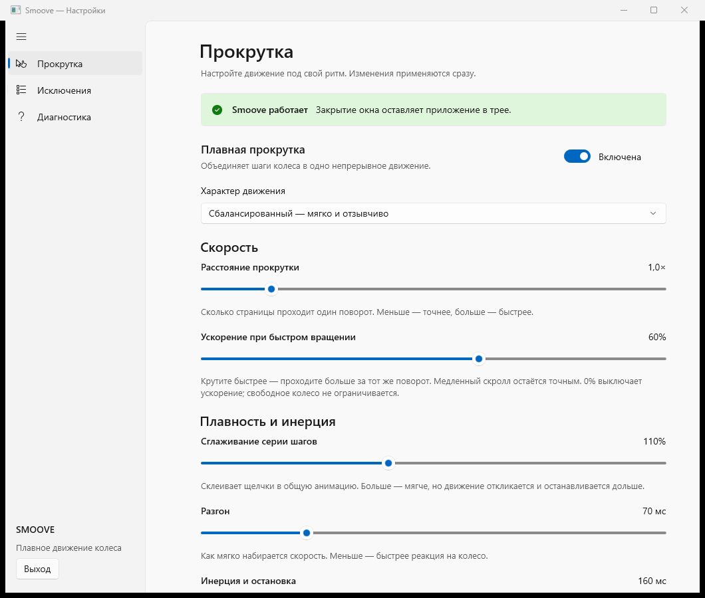

# Smoove

**Плавная прокрутка колесом мыши для Windows 11.**

Smoove объединяет щелчки колеса в непрерывное движение с мягким разгоном и остановкой. Настройте привычную мышь: от быстрого и отзывчивого движения до тягучего и инерционного.

[**Скачать для Windows 11 x64**](https://github.com/starkovskypro-code/Smoove-2.0/releases/tag/v0.5.0-beta.1) · [Инструкция](docs/USER-GUIDE.md) · [Сообщить о проблеме](https://github.com/starkovskypro-code/Smoove-2.0/issues)



## Скачать и запустить

1. Откройте [страницу релиза](https://github.com/starkovskypro-code/Smoove-2.0/releases/tag/v0.5.0-beta.1).
2. В **Assets** скачайте **Smoove-0.5.0-beta.1-win-x64.zip**. Архивы *Source code* содержат исходники, а не готовую программу.
3. Распакуйте ZIP целиком в отдельную папку.
4. Запустите **Smoove.Settings.exe** внутри неё.

Установка .NET, Windows App SDK и инструментов разработчика не нужна: библиотеки включены в архив. Не переносите один EXE отдельно от остальных файлов. Это переносимая бета-версия без установщика и автоматического обновления.

**Требования:** Windows 11, Intel/AMD x64, мышь с колесом. ARM64 и Windows 10 для этого выпуска не заявлены как проверенные. Постоянные права администратора не требуются. EXE пока не имеет цифровой подписи издателя; Windows может показать предупреждение о неизвестном приложении.

## Возможности

- **Общее плавное движение.** Каждый щелчок продолжает траекторию серии, с регулируемым разгоном и торможением.
- **Ускорение от темпа.** Быстрое ручное вращение даёт дополнительный прирост расстояния, медленное остаётся точным.
- **Свободное колесо.** Free-spin не ограничивается отдельным потолком скорости программы.
- **Настройка мягкости.** Ползунки расстояния, ускорения, сглаживания, разгона и инерции; частота событий 60/120/240/500 Гц.
- **Исключения.** Выбор из запущенных программ или по EXE, иконки, включение и удаление. Новые правила различают версии приложения по полному пути.
- **Нативные настройки Windows 11.** WinUI 3, Fluent, системная/светлая/тёмная темы.
- **Работа в трее.** Закрытие настроек оставляет фон; «Выход» завершает процесс.
- **Локальное сохранение.** Параметры сохраняются между запусками, без аккаунта и облачного сервиса.

## Как настроить

Начните с **расстояния 1×, ускорения 60%, сглаживания 110% и частоты 240 Гц**.

| Хочется | Что изменить |
|---|---|
| Быстрее проходить страницу | Увеличьте «Расстояние прокрутки» |
| Быстрее при учащённом вращении | Увеличьте «Ускорение при быстром вращении» |
| Мягче объединять шаги | Увеличьте «Сглаживание серии шагов» |
| Быстрее реагировать на колесо | Уменьшите разгон и сглаживание |
| Дольше скользить после вращения | Увеличьте «Инерция и остановка» |
| Сравнить более частые обновления | Попробуйте 500 Гц вместо 240 Гц; нагрузка может возрасти |
| Оставить приложению обычное колесо | Добавьте его на странице «Исключения» |

Частота событий — не FPS программы. Итоговая плавность зависит от приложения, дисплея, мыши и нагрузки.

## Совместимость и ограничения

Общий маршрут проверялся в диагностическом окне, локальной странице Яндекс Браузера и переписке Telegram. Пользователь проекта подтвердил работу своей мышью Logitech MX Master. Это не обещание одинакового результата во всех версиях, программах и областях интерфейса.

- Сглаживается **вертикальное колесо**; горизонтальный скролл остаётся исходным.
- Ctrl/Shift/Alt и нажатые кнопки мыши сохраняют исходные действия, например масштабирование.
- Смена окна, значительное перемещение указателя и специальные команды могут остановить хвост. Небольшое дрожание допускается.
- Повышенные и недоступные процессы, UAC и защищённые экраны не обрабатываются. Игры с античитом не заявлены как поддерживаемые.
- Некоторые программы округляют мелкие дельты или используют собственный ввод. При неудобном результате добавьте EXE в исключения.
- В разработке: отдельный пиксельный путь для списка файлов Проводника через его ScrollPattern. В релиз 0.5.0-beta.1 пока не входит; [проверки локальной сборки](docs/EXPLORER-SCROLL.md).
- Автозапуск при входе и автоматическое обновление пока не реализованы.

## Настройки, обновление и удаление

`%LOCALAPPDATA%\Smoove\settings.json` — параметры и исключения; рядом сохраняется резервная копия `.bak`. Новые исключения работают по точному нормализованному пути, старые имена EXE мигрируют в совместимый формат. Выключенное исключение сохраняется, но не действует.

Перед обновлением завершите Smoove через трей и распакуйте новый архив в новую папку. Настройки остаются в профиле пользователя. Для удаления завершите процесс и удалите папку программы; удалять настройки необязательно.

## Для разработчиков

C#/.NET 10, WinUI 3 и Windows App SDK. Требуются .NET SDK 10 и инструменты WinUI/Windows SDK.

```powershell
dotnet publish src/Smoove.Settings/Smoove.Settings.csproj -c Release -p:Platform=x64 -p:PublishTrimmed=false --self-contained true -o out/app
```

Проверки модели и нативного окна:

```powershell
.\scripts\Test-Prototype.ps1
.\scripts\Test-Settings.ps1
```

Native/browser/chat проверки управляют тестовыми окнами и курсором; Telegram-проверка работает в текущей переписке без отправки сообщений. См. [результаты](docs/REAL-INPUT-RESULTS.md).

[План](PLAN.md) · [Нативные настройки](docs/SETTINGS-UI.md) · [Исключения](docs/EXCLUSIONS.md) · [Свободное колесо](docs/FREE-SPIN-RESULTS.md) · [Ускорение и частота](docs/TEMPO-AND-PACING.md)
